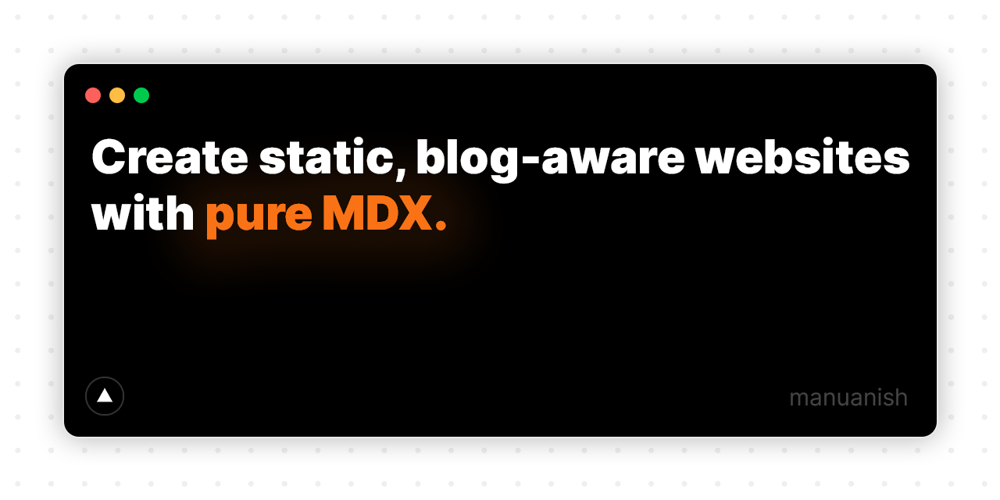
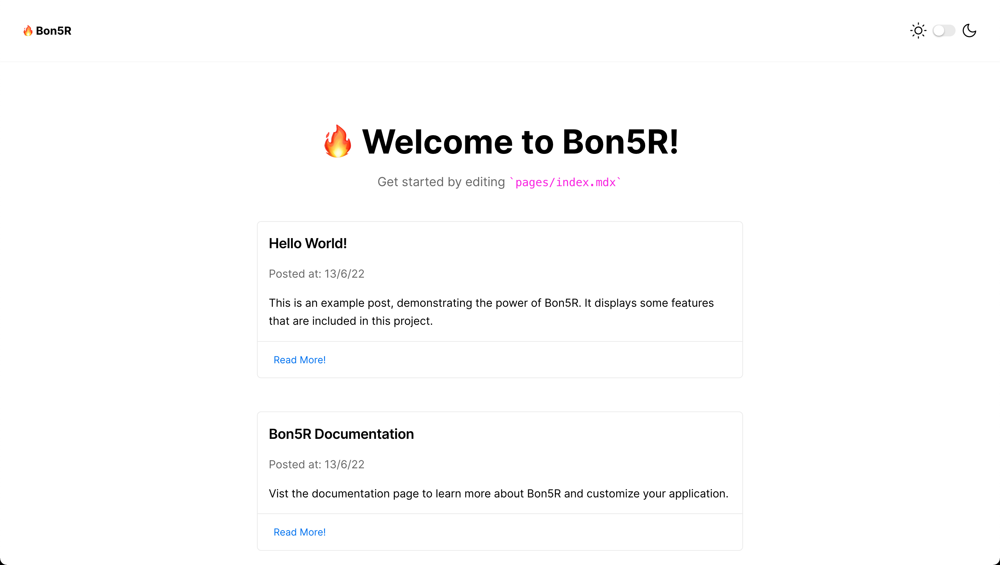
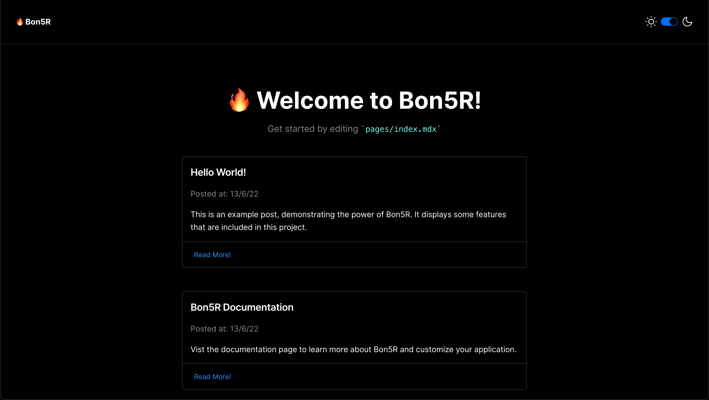

<br/>

<div id="top"></div>
<br />
<div align="center">
  <a href="https://bon5r.com">
    
  </a>

  <h3 align="center"><b>Bon5R</b></h3>

  <p align="center">
    Create static, blog-aware websites with pure MDX.
    <br />
    <a href="https://bon5r.com/docs/getting-started/"><strong>Explore the docs »</strong></a>
    <br />
    <br />
    <a href="https://bon5r.com/playground">View Demo</a>
    ·
    <a href="https://github.com/manuanish/Bon5R/issues">Report Bug</a>
    ·
    <a href="https://github.com/manuanish/Bon5R/discussions">Request Feature</a>
  </p>
</div>


<!-- TABLE OF CONTENTS -->
<details>
  <summary>Table of Contents</summary>
  <ol>
    <li>
      <a href="#about-the-project">About The Project</a>
      <ul>
        <li><a href="#built-with">Built With</a></li>
      </ul>
    </li>
    <li>
      <a href="#getting-started">Getting Started</a>
      <ul>
        <li><a href="#prerequisites">Prerequisites</a></li>
        <li><a href="#installation">Installation</a></li>
      </ul>
    </li>
    <li><a href="#usage">Usage</a></li>
    <li><a href="#roadmap">Roadmap</a></li>
    <li><a href="#contributing">Contributing</a></li>
    <li><a href="#license">License</a></li>
    <li><a href="#contact">Contact</a></li>
    <li><a href="#acknowledgments">Acknowledgments</a></li>
  </ol>
</details>

## About The Project

<!-- add animation here... -->

There are so many awesome frameworks to create websites out there but all of them require you to spend a substantial amount of time creating the website. I created Bon5R with the intention of allowing users to make their own websites using markdown which speeds up your workflow.

Here's why:

- Your time should be focused on creating something amazing. A project that solves a problem and helps others.
- You shouldn't be doing the same tasks over and over like creating a project website from scratch.
- You should implement DRY principles to the rest of your life.

Of course, no one template will serve all projects since your needs may be different. So I'll be adding more in the near future. You may also suggest changes by forking this repo and creating a pull request or opening an issue.

<p align="right">(<a href="#top">back to top</a>)</p>

### Built With

- [Next.js](https://nextjs.org/)
- [MDX](https://mdxjs.com)
- [Tailwindcss](https://tailwindcss.com/)
- [geist-ui](https://geist-ui.dev/en-us)

<p align="right">(<a href="#top">back to top</a>)</p>

<!-- GETTING STARTED -->

## Getting Started

This is an example of how you can set up your project locally. To get a local copy up and running follow these simple steps.

### Prerequisites

Before we can create the project we will require the following dependencies installed. _Begin by installing `npm` and then installing `yarn`_.

#### Install `npm`

```sh
npm install npm@latest -g
```

#### Install `yarn`

```sh
npm install --global yarn
```

### Installation

1. Clone the repo.
   ```sh
   yarn create bon5r-app my-app
   ```
2. Navigate inside the directory.
   ```sh
   cd my-app
   ```
3. Star the server.

```sh
yarn dev
```

And thats it! you can view the server by going to http://localhost:3000.

<p align="right">(<a href="#top">back to top</a>)</p>

<!-- USAGE EXAMPLES -->

## Usage

As of right now, here is the current preview of the Bon5R template website.





_For more examples, please refer to the [Documentation](https://example.com)_

<p align="right">(<a href="#top">back to top</a>)</p>

<!-- ROADMAP -->

## Roadmap

- [x] Release Bon5R v2.0.0
- [ ] Update documentation for Bon5R v2.0.0
  - [ ] Deployment documentation
  - [ ] Contributing documentation
- [ ] Add Additional Templates for Bon5R

See the [open issues](https://github.com/manuanish/Bon5R/issues) for a full list of proposed features (and known issues).

<p align="right">(<a href="#top">back to top</a>)</p>

<!-- CONTRIBUTING -->

## Contributing

Contributions are what make the open source community such an amazing place to learn, inspire, and create. Any contributions you make are **greatly appreciated**.

If you have a suggestion that would make this better, please fork the repo and create a pull request. You can also simply open an issue with the tag "enhancement".
Don't forget to give the project a star! Thanks again!

1. Fork the Project
2. Create your Feature Branch (`git checkout -b feature/AmazingFeature`)
3. Commit your Changes (`git commit -m 'Add some AmazingFeature'`)
4. Push to the Branch (`git push origin feature/AmazingFeature`)
5. Open a Pull Request

<p align="right">(<a href="#top">back to top</a>)</p>

<!-- LICENSE -->

## License

Distributed under the MIT License. See the `LICENSE` file for more information.

<p align="right">(<a href="#top">back to top</a>)</p>

<!-- CONTACT -->

## Contact

Your Name - [@manusanish](https://twitter.com/manusanish) - manusanish@gmail.com

Project Link: [https://github.com/manuanish/bon5r](https://github.com/manuanish/bon5r)

<p align="right">(<a href="#top">back to top</a>)</p>

<!-- ACKNOWLEDGMENTS -->
